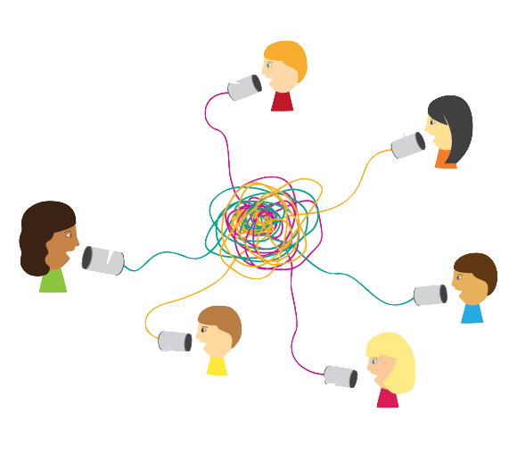

# Getting to Know YOU! Who’s Got a Link?

# Let’s start with a volunteer!

- That person will take a piece of string, say their name, and say something about themselves (ie. an experience they’ve had, something interesting about themselves or something they like).
- Someone who also identifies with that statement must yell “I have a link” and join the person holding the string.  
- Then, they too, should share their name and say something interesting about themselves until the whole class has “linked!”
