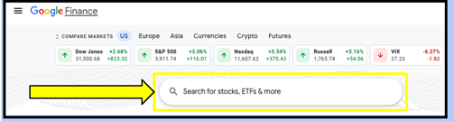

# TAKE ACTION

Now that you know what it means to own individual stocks and how to choose companies to invest in, let’s see how some popular stocks are doing in the market! Compare the performances of these stocks using Google Finance to answer the questions.

To check the performance of each stock, type the name of the company into the search bar on Google Finance. 

## Each company has an abbreviated name called a ticker symbol. What is the ticker for each of these companies? 

### Chipotle
<sparkle-feed-post assignment-name="Ticker - Chipotle" ></sparkle-feed-post>
### Nike
<sparkle-feed-post assignment-name="Ticker - Nike" ></sparkle-feed-post>
### Amazon
<sparkle-feed-post assignment-name="Ticker - Amazon" ></sparkle-feed-post>
### Snap Inc
<sparkle-feed-post assignment-name="Ticker - Snap Inc" ></sparkle-feed-post>

## Which of these stocks has seen a significant rise in stock price in the past year? Which ones have stayed about the same? Have any decreased in price? 
<sparkle-feed-post assignment-name="Which of these stocks has seen a significant rise in stock price in the past year? Which ones have stayed about the same?" ></sparkle-feed-post>

## Look at the 5-year performance for Chipotle. Why do you think there was such a huge decrease in price in January 2016? (Hint: you might want to look it up!) 
<sparkle-feed-post assignment-name="Why do you think there was such a huge decrease in price in January 2016?" ></sparkle-feed-post>

## Now look at the 5-year performance of Amazon. What do you think explains the general upward trend of the stock price?
<sparkle-feed-post assignment-name="What do you think explains the general upward trend of the stock price?" ></sparkle-feed-post>

