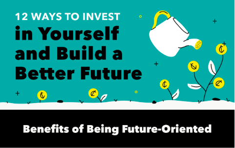
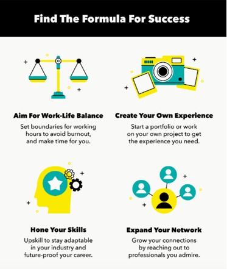
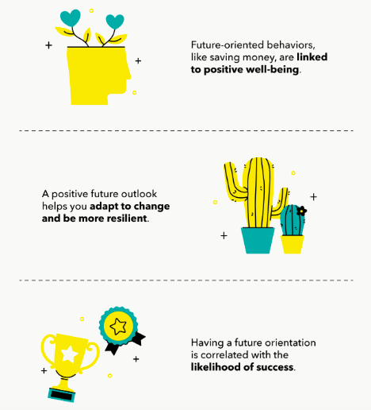
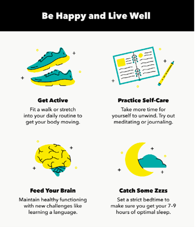

# TAKE ACTION

What does it mean to invest? In what ways are you investing in your future in your daily life?

## 12 Ways to Invest in Yourself and Build a Better Future by <a href="https://mint.intuit.com/blog/author/mintcom/" target="_blank">Mint</a>

Investing in yourself means investing in your financial wellbeing, health, career, interests, as well as stocks and bonds. Investing is a mindset to set yourself up for success. Here are some of the best investments you can make.

<!--

 -->

## Tell the class what you are doing to invest in yourself!

People with higher education are healthier, live longer.

And they are more likely to invest their money in the stock market, and accumulate more wealth through investing.

## Calculate your monthly expenses and how much you're able to save up to invest at the end of a year, six months.

<sparkle-feed-post assignment-name="Calculate your monthly expenses and how much you're able to save up to invest at the end of a year, six months." ></sparkle-feed-post>

## Describe your educational goals to the class, in terms of how much you plan to earn, save, invest.

<sparkle-feed-post assignment-name="Describe your educational goals to the class, in terms of how much you plan to earn, save, invest." ></sparkle-feed-post>
