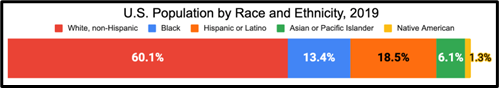

# Part III: Investments by Race, Ethnicity, and Market Experience

Notes:
New Investors: People who opened investment accounts in 2020 for the first time ever. 
Experienced Entrants: People who opened investments accounts in 2020 and had accounts previously
Holdover Account Owners: People who did not open a new account in 2020 but had previous accounts  
This FINRA chart focuses on investors who opened taxable investment accounts in 2020. It does not include accounts for retirement or education. 

1. How does the racial and ethnic composition of holdover account owners compare to national demographics? Refer to the chart below based on U.S. Census data.

 

2. How do the demographics of new investors compare to the demographics of “holdover account owners” who were already invested in the market?

3. How do you think the overall demographics of investors will change over time? Why? 

4.	Do you think these changing demographics will decrease wealth inequality in the U.S.? Why or why not? 
