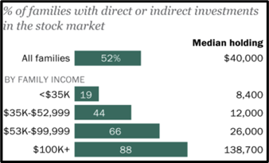

# PART II: INVESTMENTS BY INCOME

Notes: 
The graph represents families owning any type of investment in the stock market. 
“Direct investments” include individual stocks and bonds
“Indirect investments” include mutual funds, retirement accounts, or other managed assets.
“Median holding” refers to how much the median investment is worth in that category. 

1. What percent of all families own investments?

2. What percent of families earning between $35,000 and $52,999 have investments? What is the median value of those investments?

3. How does income level correlate to the likelihood of having investments? Why do you think that’s the case?

4. Why does the median holding value jump significantly between families earning under $100,000 and families earning more than $100,000?
