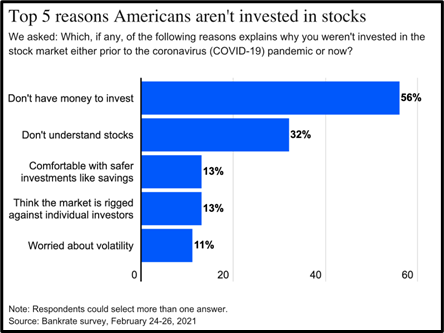

# Part I: Why People Don’t Invest

1. According to the survey, what is the most common reason people are not invested in the stock market? Does that surprise you? Why or why not?

2. How would you generalize the overarching idea that explains reasons 3, 4, and 5?

3. Based on what you know about saving and investing, what are the disadvantages of having your money in safer accounts, like savings?

4. The graph illustrates the factors that prevent many people from investing. What policies or changes might encourage more Americans to invest? Why?
