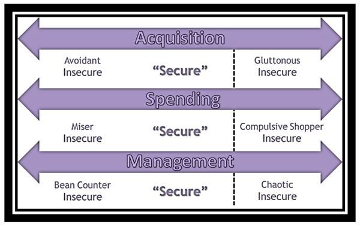

# Take Action

## Where do you fall on the spectrum and how can you improve your relationship with money?

- Acquisition: How much money is necessary for you to feel secure? 
- Spending: Are you a penny pincher or an out f control spender? We hear about movie stars and athletes who make millions a year and end up broke. Are you intentional, and reasonable in your spending?
- Management: This includes how you save, how you pay your bills and how you invest. Are you responsible in paying your bills and saving? 
